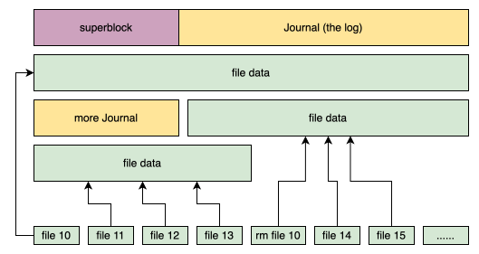
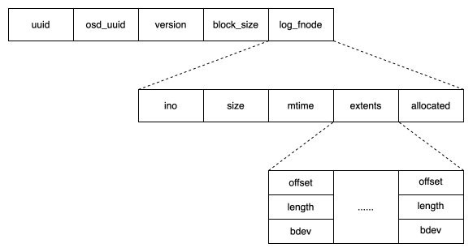
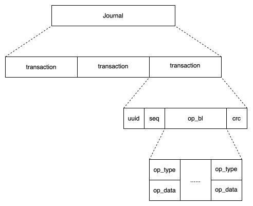
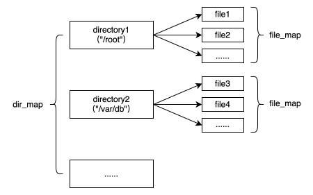

## 前言

本篇文章我们重点分析 BlueFS 的几个主要的数据结构，通过对数据结构的分析引出 BlueFS 磁盘布局、内存组织等，为后续的 I/O 分析建立基础。

## 数据结构

### bluefs_extent_t

```C++
class bluefs_extent_t {
  uint64_t offset = 0;    // 该 extent 的起始位置在磁盘上的偏移
  uint32_t length = 0;    // 该 extent 的长度
  uint8_t bdev;           // 该 extent 所在磁盘
};
```

### bluefs_fnode_t

```C++
struct bluefs_fnode_t {
  uint64_t ino;           // inode 编号
  uint64_t size;          // 文件大小
  utime_t mtime;          // 文件修改时间
  uint8_t __unused__ = 0; // 之前为有限使用哪个 block device

  mempool::bluefs::vector<bluefs_extent_t> extents; // 每个文件由多段 extent 组成
  mempool::bluefs::vector<uint64_t> extents_index;

  uint64_t allocated;          // 文件已分配的空间大小
  uint64_t allocated_commited; // 文件已记录到 Log 中的空间大小
};
```

### bluefs_super_t

```C++
struct bluefs_super_t {
  uuid_d uuid;                // 唯一 uuid
  uuid_d osd_uuid;            // 所属 OSD 的 uuid
  uint64_t version;           // 版本
  uint32_t block_size;        // 磁盘块大小
  bluefs_fnode_t log_fnode;   // 记录 BlueFS 所有文件元数据的 Log 文件的 inode
};
```

### File

```C++
struct File : public RefCountedObject {
  bluefs_fnode_t fnode;     // 文件 inode
  uint64_t       dirty_seq; // dirty 序列号，会以该序列号为索引插入到 dirty->files 中
  int            refs;      // 引用计数
  bool           locked;    // 表示文件是否加锁
  bool           deleted;   //
  bool           is_dirty;  // 表示文件元数据发生变化需要更新 log

  boost::intrusive::list_member_hook<> dirty_item; // 用于将本文件链接到待刷新文件链表的链接件
  std::atomic_int num_readers, num_writers;        // 读写计数
  std::atomic_int num_reading;                     // 正在执行的读请求技术
  void* vselector_hint = nullptr;                  // 卷选择器
  ceph::mutex lock = ceph::make_mutex("BlueFS::File::lock");
};
using FileRef = ceph::ref_t<File>;
```

主要成员说明如下：

- File 类继承 RefCountedObject 类，当 File 的引用计数归零时会自动释放该对象
- dirty_seq 表示文件更新序列，会以该值为键值插入到 BlueFS 结构中的 dirty.file 中，用于批量更新文件元数据
- locked 表示文件是否被加锁，由于 BlueFS 元数据是全内存的，因此也仅在内存中表示是否加锁

### FileWriter

```C++
struct FileWriter {
  FileRef file;                   // 指向的文件
  uint64_t pos = 0;               // 文件位置指针
private:
  ceph::buffer::list buffer;      // 调用 append 接口时数据会先追加到该 buffer 中
  ceph::buffer::list tail_block;  // 写操作需要按照后端块设备的 block size 对齐，不对齐时需要补 0
                                  // 该成员保存本次写入的 buffer 中结尾不够 block size 的部分
                                  // 便于在下次写入时追加到下次写入 buffer 的前边，以防止覆盖 block 时数据丢失

public:
  ceph::mutex lock = ceph::make_mutex("BlueFS::FileWriter::lock");
  std::array<IOContext*,MAX_BDEV> iocv;   // 每个后端磁盘一个 I/O 上下文，用于处理 I/O
  std::array<bool, MAX_BDEV> dirty_devs;  // 表示后端磁盘是否有需要下刷的数据
};
```

### FileReader

```C++
struct FileReaderBuffer {
  uint64_t bl_off = 0;    // 预读到的位置的偏移
  ceph::buffer::list bl;  // 预读的 buffer
  uint64_t pos = 0;       // 文件位置指针
  uint64_t max_prefetch;  // 单次预读的最大数据量
};

struct FileReader {
  FileRef file;         // 指向对应的文件，引用计数为 0 时自动释放
  FileReaderBuffer buf; // 读数据的缓存
  bool random;          // 是否是随机读
  bool ignore_eof;

  // 读写锁，读取 buf 时加读锁以支持并发，读到新的位置 buf 发生变化时加写锁
  ceph::shared_mutex lock {
    ceph::make_shared_mutex(std::string(), false, false, false)
  };
};
```

### BlueFS

```C++
class BlueFS {
  typedef boost::intrusive::list<
    File,
    boost::intrusive::member_hook<
      File,
      boost::intrusive::list_member_hook<>,
      &File::dirty_item> > dirty_file_list_t; // 所有需要更新元数据的文件列表

  // BlueFS 管理的所有文件和目录全部保存在该结构体中
  struct {
    ceph::mutex lock = ceph::make_mutex("BlueFS::nodes.lock");      // 访问内存的互斥锁
    mempool::bluefs::map<std::string, DirRef, std::less<>> dir_map; // 所有的目录
    mempool::bluefs::unordered_map<uint64_t, FileRef> file_map;     // 所有的文件
  } nodes;

  bluefs_super_t super; // 超级块

  // 所有元数据变化都要通过该 log 对象写到 Log 文件中
  struct {
    ceph::mutex lock = ceph::make_mutex("BlueFS::log.lock");
    uint64_t seq_live = 1;   // 更新序列
    FileWriter *writer = 0;  // Log 文件的写句柄
    bluefs_transaction_t t;  // 包含多个 OP 的事务
  } log;

  // 管理所有 BlueFS 中发生变化需要写到 Log 中的元数据
  struct {
    ceph::mutex lock = ceph::make_mutex("BlueFS::dirty.lock");
    uint64_t seq_stable = 0; // 已经写到 Log 上的序列
    uint64_t seq_live = 1;   // 等待写入 Log 上的序列

    std::map<uint64_t, dirty_file_list_t> files;          // 第一个成员表示跟新序列，第二个成员表示对应序列下的文件列表
    std::vector<interval_set<uint64_t>> pending_release;  // 等到释放的 extent 集合
  } dirty;

  // 如果正在执行 Log Compaction，元数据的更新需要再此条件变量上等待
  ceph::condition_variable log_cond;

  std::vector<BlockDevice*> bdev;        // 组成 BlueFS 的后端磁盘数组
  std::vector<IOContext*> ioc;           // 每个后端磁盘对应的 I/O 上下文
  std::vector<uint64_t> block_reserved;  // 每个后端磁盘预留的空间
  std::vector<Allocator*> alloc;         // 每个后端磁盘对应的空间分配器
  std::vector<uint64_t> alloc_size;      // 每个后端磁盘已分配的空间

  std::unique_ptr<BlueFSVolumeSelector> vselector;       // 卷选择器
  bluefs_shared_alloc_context_t* shared_alloc = nullptr; // 与 BlueStore 共享的磁盘空间分配器
}
```

### 加锁

通过 BlueFS 结构体可以看到，内部有多个锁，加锁顺序如下：

```C++
 *     >        | W | L | N | D | F
 * -------------|---|---|---|---|---
 * FileWriter W |   | > | > | > | >
 * log        L |       | > | > | >
 * nodes      N |           | > | >
 * dirty      D |           |   | >
 * File       F |
```

当代码逻辑需要加多个锁的时候，需要按照上述顺序加锁，以防出现死锁。

## 图示

### Layout

通过下图表示 BlueFS 各个文件在磁盘上的布局：



### SuperBlock

superblock 的组织形式如下图所示：



### Journal

Log 的组织形式如下图所示：



### File map



## 总结

通过以上内容的描述，希望能对 BlueFS 的数据结构和组织形式有一定的理解。
