## 1. 总体流程

当一个读请求的覆盖范围落在一个 chunk 范围内时为对齐读，流程图如下所示：



## 2. 入口

在 RAID5 的 I/O 处理函数 `make_request()` 一开始进行了对齐读的判断和处理，代码如下所示：

```C++
/* 
 * rw == READ 判断是不是读请求
 * mddev->reshape_position == MaxSector 判断是否正在reshape
 *   reshape时数据分布发生变化且以条带为单位进行，故此时只能通过条带读数据
 * chunk_aligned_read(mddev,bi) 调用该函数判断并执行对齐读
 */
if (rw == READ
    && mddev->reshape_position == MaxSector
    && chunk_aligned_read(mddev, bi))
        return;
```

## 3. 下发

对齐读通过函数 `chunk_aligned_read()` 下发，其代码逻辑如下所示：

```C++
static int chunk_aligned_read(struct mddev *mddev, struct bio *raid_bio)
{
        struct r5conf *conf = mddev->private;
        int dd_idx;
        struct bio* align_bi;
        struct md_rdev *rdev;
        sector_t end_sector;
 
        /* 
         * 行判断IO是否在chunk范围内，如果不在则返回0到make_request中
         * 继续向下执行通过条带读取数据
         */
        if (!in_chunk_boundary(mddev, raid_bio)) {
                pr_debug("chunk_aligned_read : non aligned\n");
                return 0;
        }
 
        /* 克隆一个新的bio用于对齐读 */
        align_bi = bio_clone_mddev(raid_bio, GFP_NOIO, mddev);
        if (!align_bi)
                return 0;
 
        /* 设置回调函数 */
        align_bi->bi_end_io  = raid5_align_endio;
        /* 在向上层返回IO结果或重试条带读时使用原始bio */
        align_bi->bi_private = raid_bio;
 
        /* 
         * 根据原始bio的起始位置计算其在RAID成员磁盘中的位置 
         * 并获取所属成员磁盘索引dd_idx
         */  
        align_bi->bi_sector = raid5_compute_sector(conf, raid_bio->bi_sector,
                                                   0,
                                                   &dd_idx, NULL);
 
        /* 
         * 获取成员磁盘指针
         * 如果在做磁盘替换且新盘状态正常且重构进度大于bio的结束位置
         * 说明此时新盘包含了要读的数据，此时通过新盘读取，否则判断旧盘是否可读
         * 如果旧盘状态正常，且重构进度大于bio的结束位置，则可以通过旧盘读取
         * 如果新盘旧盘两者条件都不满足，则rdev会设置为NULL
         */
        end_sector = bio_end_sector(align_bi);
        rcu_read_lock();
        rdev = rcu_dereference(conf->disks[dd_idx].replacement);
        if (!rdev || test_bit(Faulty, &rdev->flags) ||
                rdev->recovery_offset < end_sector) {
                rdev = rcu_dereference(conf->disks[dd_idx].rdev);
                if (rdev &&
                        (test_bit(Faulty, &rdev->flags) ||
                        !(test_bit(In_sync, &rdev->flags) ||
                          rdev->recovery_offset >= end_sector)))
                        rdev = NULL;
        }
 
        /* 处理成员磁盘可读的场景 */
        if (rdev) {
                sector_t first_bad;
                int bad_sectors;
 
                /* 自增成员磁盘的pending io计数 */
                atomic_inc(&rdev->nr_pending);
                rcu_read_unlock();
                /* 
                 * 将成员磁盘指针赋值给原始bio的bi_next域用于在回调函数中获取bio所属成员磁盘
                 * 在对齐读中，使用克隆的bio所以原始bio的bi_next域不会被使用
                 */
                raid_bio->bi_next = (void*)rdev;
                /* 设置bio所属成员磁盘的块设备指针 */
                align_bi->bi_bdev = rdev->bdev;
                /* 
                 * 设置BIO_SEG_VALID标记，表明bi_phys_segments是有效的
                 * bi_phys_segments是bio要处理的“物理地址连续数据段”的计数
                 * 即有多少段连续的数据
                 */
                align_bi->bi_flags &= ~(1 << BIO_SEG_VALID);
 
                /**
                 * 判断bio能否下发。
                 * 首先调用bio_fits_rdev判断bio的属性是否满足底层块设备的限制
                 * 然后调用is_badblock判断bio覆盖的范围是否有坏块
                 * 如果不满足底层块设备限制或有坏块，则不能进行对齐读
                 * 释放克隆的bio自减成员磁盘pending io计数后返回0到make_request中
                 * 使其向下执行，通过条带读取数据
                 */
                if (!bio_fits_rdev(align_bi) ||
                        is_badblock(rdev, align_bi->bi_sector, bio_sectors(align_bi),
                                &first_bad, &bad_sectors)) {
                        /* too big in some way, or has a known bad block */
                        bio_put(align_bi);
                        rdev_dec_pending(rdev, mddev);
                        return 0;
                }
 
                /* 设置bio相对于底层磁盘的起始位置 */
                align_bi->bi_sector += rdev->data_offset;
 
                /* 等待RAID解除“静默”。RAID可被用户手动设置为“静默”状态即不处理业务 */
                spin_lock_irq(&conf->device_lock);
                wait_event_lock_irq(conf->wait_for_stripe,
                                    conf->quiesce == 0,
                                    conf->device_lock);
                atomic_inc(&conf->active_aligned_reads);
                spin_unlock_irq(&conf->device_lock);
 
                if (mddev->gendisk)
                        /* 用于块设备的IO统计 */
                        trace_block_bio_remap(bdev_get_queue(align_bi->bi_bdev),
                                              align_bi, disk_devt(mddev->gendisk),
                                              raid_bio->bi_sector);
 
                /* 调用generic_make_request将bio提交到底层块设备处理 */
                generic_make_request(align_bi);
                /* 返回1到make_request中，make_request结束，等待IO完成后的回调 */
                return 1;
        } else {
                /* 
                 * 处理rdev被赋值为NULL的情况，此时释放克隆的bio
                 * 返回0到make_request中继续向下执行，通过条带读取数据
                 */
                rcu_read_unlock();
                bio_put(align_bi);
                return 0;
        }
}
```

## 4. 回调

对齐读请求的回调函数为 `raid5_align_endio()` ，其代码逻辑如下所示：

```C++
/* error参数表示IO执行是否异常 */
static void raid5_align_endio(struct bio *bi, int error)
{
        struct bio* raid_bi  = bi->bi_private;
        struct mddev *mddev;
        struct r5conf *conf;
        /* 获取IO执行结果。如果成功则设置BIO_UPTODATE标记，uptodate为真 */
        int uptodate = test_bit(BIO_UPTODATE, &bi->bi_flags);
        struct md_rdev *rdev;
 
        /* 无论IO执行是否成功，都可以将之前克隆的bio释放掉 */
        bio_put(bi);
        /* 获取bio所在RAID的成员磁盘 */
        rdev = (void*)raid_bi->bi_next;
        raid_bi->bi_next = NULL;
        mddev = rdev->mddev;
        conf = mddev->private;
 
        /* IO执行完毕，自减成员磁盘的pending io计数 */
        rdev_dec_pending(rdev, conf->mddev);
 
        /* 
         * IO执行成功，调用trace_block_bio_complete设置IO统计信息
         * 调用bio_endio向上层返回成功，当正在处理的对齐读为0时唤醒等待条带的进程
         */
        if (!error && uptodate) {
                trace_block_bio_complete(bdev_get_queue(raid_bi->bi_bdev),
                                         raid_bi, 0);
                bio_endio(raid_bi, 0);
                if (atomic_dec_and_test(&conf->active_aligned_reads))
                        wake_up(&conf->wait_for_stripe);
                return;
        }
 
        /* 对齐读失败，调用add_bio_to_retry将bio添加到重试链表中进行重试 */
        pr_debug("raid5_align_endio : io error...handing IO for a retry\n");
        add_bio_to_retry(raid_bi, conf);
}
```

## 5. 重试

先将 bio 加入到重试链表中，再有 `raid5d()` 统一处理，代码逻辑如下所示：

```C++
static void add_bio_to_retry(struct bio *bi,struct r5conf *conf)
{
        unsigned long flags;
 
        spin_lock_irqsave(&conf->device_lock, flags);
 
        /* 将bio插入到重试链表retry_read_aligned_list的头部 */
        bi->bi_next = conf->retry_read_aligned_list;
        conf->retry_read_aligned_list = bi;
 
        spin_unlock_irqrestore(&conf->device_lock, flags);
 
        /* 唤醒raid5d线程处理请求 */
        md_wakeup_thread(conf->mddev->thread);
}
 
/* 这里只截取了对齐读重试的代码 */
static void raid5d(struct md_thread *thread)
{
        ...
 
        /* 从重试链表中获取一个待重试的bio */
        while ((bio = remove_bio_from_retry(conf))) {
                int ok;
                spin_unlock_irq(&conf->device_lock);
                /* 进行重试 */
                ok = retry_aligned_read(conf, bio);
                spin_lock_irq(&conf->device_lock);
                if (!ok)
                        break;
                handled++;
        }
 
        ...
}
 
static struct bio *remove_bio_from_retry(struct r5conf *conf)
{
        struct bio *bi;
 
        /* 
         * retry_read_aligned中保存上一次重试未完成的对齐读
         * 所以这里优先返回上一次未重试完成的对齐读请求
         */
        bi = conf->retry_read_aligned;
        if (bi) {
                conf->retry_read_aligned = NULL;
                return bi;
        }
 
        /* 
         * 从retry_read_aligned_list链表头部取出第一个需要重试的对齐读请求
         * 调用raid5_set_bi_stripes设置bi_phys_segments计数为1
         */
        bi = conf->retry_read_aligned_list;
        if(bi) {
                conf->retry_read_aligned_list = bi->bi_next;
                bi->bi_next = NULL;
                /*
                 * this sets the active strip count to 1 and the processed
                 * strip count to zero (upper 8 bits)
                 */
                raid5_set_bi_stripes(bi, 1); /* biased count of active stripes */
        }
 
        /* 返回请求到raid5d中 */
        return bi;
}
 
static int retry_aligned_read(struct r5conf *conf, struct bio *raid_bio)
{
        /* We may not be able to submit a whole bio at once as there
         * may not be enough stripe_heads available.
         * We cannot pre-allocate enough stripe_heads as we may need
         * more than exist in the cache (if we allow ever large chunks).
         * So we do one stripe head at a time and record in
         * ->bi_hw_segments how many have been done.
         *
         * We *know* that this entire raid_bio is in one chunk, so
         * it will be only one 'dd_idx' and only need one call to raid5_compute_sector.
         */
        struct stripe_head *sh;
        int dd_idx;
        sector_t sector, logical_sector, last_sector;
        int scnt = 0;
        int remaining;
        int handled = 0;
 
        /* 获取bio所在条带头的起始位置 */
        logical_sector = raid_bio->bi_sector & ~((sector_t)STRIPE_SECTORS-1);
        /* 获取bio相对于其所属RAID成员磁盘的起始位置的偏移 */
        sector = raid5_compute_sector(conf, logical_sector,
                                      0, &dd_idx, NULL);
        /* 获取bio的结束扇区数 */
        last_sector = bio_end_sector(raid_bio);
 
        /* 
         * 由于RAID5处理数据的单位是条带，所以这里使用for循环进行bio逻辑上的“切割”
         * 将bio挂载到相应的条带上。scnt是bio处理的条带计数，随着条带的下发进行自增
         */
        for (; logical_sector < last_sector;
                 logical_sector += STRIPE_SECTORS,
                         sector += STRIPE_SECTORS,
                         scnt++) {
 
                /* 
                 * 跳过该bio已经处理的部分
                 * bio可能在没有全部下发的情况下退出该函数（如获取不到空闲条带）
                 * 此时会通过raid5_set_bi_processed_stripes函数设置已处理过的条带计数
                 */
                if (scnt < raid5_bi_processed_stripes(raid_bio))
                        /* already done this stripe */
                        continue;
 
                /* 
                 * 获取一个空闲的条带
                 * 如果获取失败，则设置已处理条带计数，将bio挂载到
                 * 未处理完成的对齐读重试链表retry_read_aligned中返回
                 */
                sh = get_active_stripe(conf, sector, 0, 1, 0);
                if (!sh) {
                        /* failed to get a stripe - must wait */
                        raid5_set_bi_processed_stripes(raid_bio, scnt);
                        conf->retry_read_aligned = raid_bio;
                        return handled;
                }
 
                /* 将bio添加到链表中，如果添加失败处理同上 */
                if (!add_stripe_bio(sh, raid_bio, dd_idx, 0)) {
                        release_stripe(sh);
                        raid5_set_bi_processed_stripes(raid_bio, scnt);
                        conf->retry_read_aligned = raid_bio;
                        return handled;
                }
 
                /* 设置不合并属性 */
                set_bit(R5_ReadNoMerge, &sh->dev[dd_idx].flags);
                /* 将条带推入状态机处理 */
                handle_stripe(sh);
                release_stripe(sh);
                handled++;
        }
 
        /* 
         * 如果bio的bi_phys_segments计数为0则说明已处理完毕
         * 调用bio_endio向上层返回
         */
        remaining = raid5_dec_bi_active_stripes(raid_bio);
        if (remaining == 0) {
                trace_block_bio_complete(bdev_get_queue(raid_bio->bi_bdev),
                                         raid_bio, 0);
                bio_endio(raid_bio, 0);
        }
 
        /* 如果正在重试的对齐读为0则唤醒等待条带的线程 */
        if (atomic_dec_and_test(&conf->active_aligned_reads))
                wake_up(&conf->wait_for_stripe);
        return handled;
}
```

自此，重试的对齐读改为通过条带获取其数据，剩下的流程和条带读相同，统一放到条带读流程中进行分析。
